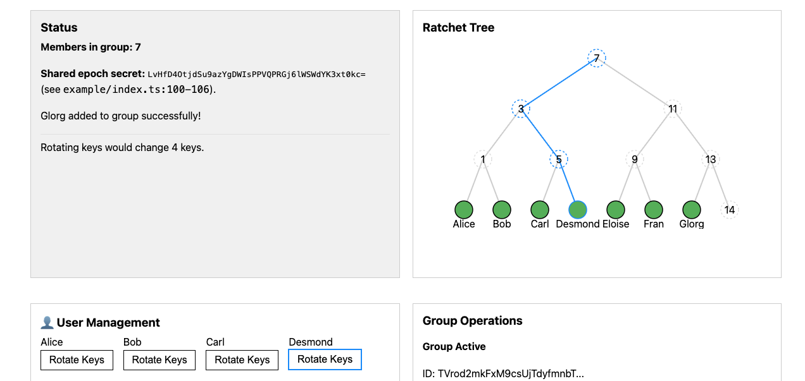

# Webcrypto MLS
[](https://github.com/vanishing-page/webcrypto-mls/actions/workflows/nodejs.yml)
[](https://arethetypeswrong.github.io/?p=%40vanishing.page%2Fwebcrypto-mls)
[](README.md)
[](https://semver.org/)
[](./CHANGELOG.md)
[](https://packagephobia.com/result?p=@vanishing.page/webcrypto-mls)
[]((https://bundlephobia.com/package/@vanishing.page/webcrypto-mls))
[](LICENSE)


MLS [(RFC 9420)](https://www.rfc-editor.org/rfc/rfc9420) for the browser.

MLS is a protocol for end-to-end encrypted group messaging.
It keeps a shared secret in sync across a group of participants as members join
and leave, and does not cause an `O(n)` blowup in the number of
messages or keys.

This implementation uses the
[webcyrpto API](https://developer.mozilla.org/en-US/docs/Web/API/Web_Crypto_API),
which means it is usable in the browser.

[See a live demo](https://vanishing-page.github.io/webcrypto-mls/)

<details><summary><h2>Contents</h2></summary>

<!-- toc -->

- [Install](#install)
- [Fork](#fork)
- [Example](#example)
  * [Joining the Group](#joining-the-group)
  * [Use with pre-existing keypairs](#use-with-pre-existing-keypairs)
- [Security Properties](#security-properties)
  * [Security Considerations](#security-considerations)
- [Scenarios](#scenarios)
  * [Key Rotation](#key-rotation)
    + [What data is transferred?](#what-data-is-transferred)
    + [Key Rotation Example Code](#key-rotation-example-code)
  * [Persistence](#persistence)
    + [`indexedDB` Helpers](#indexeddb-helpers)
  * [Catching Up](#catching-up)
    + [Catch Up Example](#catch-up-example)
- [API](#api)
  * [`createCommit`](#createcommit)
    + [parameters](#parameters)
    + [returns](#returns)
- [Ratchet](#ratchet)
  * [Double Ratchet](#double-ratchet)
  * [MLS Ratchet](#mls-ratchet)
    + [1. The message-level ratchet (forward secrecy)](#1-the-message-level-ratchet-forward-secrecy)
    + [2. The epoch-level ratchet (post-compromise security)](#2-the-epoch-level-ratchet-post-compromise-security)
- [Root Secret](#root-secret)
- [Defaults](#defaults)
  * [Optional Ciphersuite Dependencies](#optional-ciphersuite-dependencies)
- [Some Terms](#some-terms)
  * [Leaf-node Keypair](#leaf-node-keypair)
  * [Commits and Proposals](#commits-and-proposals)
    + [Proposal](#proposal)
    + [Commit](#commit)
  * [Key Schedule](#key-schedule)
    + [Epoch Authenticator](#epoch-authenticator)
    + [Epoch Secret](#epoch-secret)
  * [Key package](#key-package)
  * [Ratchet tree](#ratchet-tree)
  * [`TreeKEM` (key rotation)](#treekem-key-rotation)
    + [2. key distribution](#2-key-distribution)
  * [Welcome messages](#welcome-messages)
    + [The New Group Member](#the-new-group-member)
- [Forward secrecy and post-compromise security](#forward-secrecy-and-post-compromise-security)
- [Develop](#develop)
- [Modules](#modules)
  * [ESM](#esm)
  * [Common JS](#common-js)
- [Use](#use)
  * [JS](#js)
  * [pre-built JS](#pre-built-js)
    + [copy](#copy)
    + [HTML](#html)

<!-- tocstop -->

</details>

## Install

```sh
npm i -S @vanishing.page/webcrypto-mls
```

## Fork

This is a fork of [LukaJCB/ts-mls](https://github.com/LukaJCB/ts-mls).

-----------------

## Example

See [./example](./example/index.ts), or
[the deployed page](https://vanishing-page.github.io/webcrypto-mls/). It is a
webpage with controls for all the mechanics of MLS.

The core flow:

1. `generateKeyPackage` for each client. 
   This runs locally on each client's device, before they know what
   group they'll join.
2. `createGroup` to start a group, or `joinGroup` to join via a
   [welcome message](#welcome-messages).
3. `createCommit` to add or remove members or rotate keys.
   See [commit messages](#commit).
4. `createApplicationMessage` and `processPublicMessage` to send and
   receive encrypted group messages.

An _application message_ is the spec's term for arbitrary user data sent
through the group (as opposed to a [`proposal`](#proposal) or [`commit`](#commit),
which carry protocol control data).

In MLS [(RFC 9420)](https://www.rfc-editor.org/rfc/rfc9420),
group membership and keying material never change
unilaterally. Every change to the group goes through a two-phase
propose-then-commit cycle. This codebase's
[`proposal.ts`](./src/proposal.ts) and [`commit.ts`](./src/commit.ts)
are the wire types for those two phases.

The [tree KEM](#treekem-key-rotation) structure is used for efficient
updates of key material. It is not used in any way by application code. That
is, an incoming message can be encrypted to the whole group, not a subtree
of the group.

### Joining the Group

Before joining a group, the new group member must generate a `KeyPackage`
locally. The key package contains 3 keypairs:

1. the signature keypair - this signs their future group messages/proposals.
2. HPKE initial keypair - used only once, to decrypt the group secrets in
   the welcome message.
3. HPKE leaf-node keypair - used consistently as their position in the group's
   ratchet tree

The pending new group member must share the public half of all three keypairs
(the `KeyPackage` object). The key package object is signed by their signature
key. The public `KeyPackage` is wrapped in an `Add` proposal, which brings them
into the group.

The initial HPKE keypair is single-use for the sake of "forward secrecy,"
meaning that, if we used a persistent keypair, then the encrypted `GroupSecret`s
in the `Welcome` message stays decryptable by anyone who has that keypair.

When a committer adds a new member via an Add proposal, the committer
HPKE-encrypts the GroupSecrets to the init public key, and that ciphertext
goes out in the Welcome message. The new member decrypts it once, with the
init private key, to bootstrap into the group.

```ts
import {
    generateKeyPackage,
    defaultCapabilities,
    defaultLifetime,
    getCipherSuite,
    createGroup,
    createCommit,
    joinGroup,
    createApplicationMessage,
    processMessage,
    makePskIndex,
    acceptAll
} from '@vanishing.page/webcrypto-mls'

//  use the default ciphersuite given no arguments
const cipherSuite = await getCipherSuite(
    // DEFAULT_CIPHERSUITE -- 'MLS_128_DHKEMX25519_AES128GCM_SHA256_Ed25519'
    // defaultCryptoProvider -- 'src/crypto/implementation/default/provider.js'
)

// 1. generateKeyPackage for each client
const alice = await generateKeyPackage(
    {
        credentialType: 'basic',
        identity: new TextEncoder().encode('alice')
    },
    defaultCapabilities(),
    defaultLifetime,
    [],
    cipherSuite
)

const bob = await generateKeyPackage(
    { credentialType: 'basic', identity: new TextEncoder().encode('bob') },
    defaultCapabilities(),
    defaultLifetime,
    [],
    cipherSuite
)

// 2. createGroup to start a group
const groupId = cipherSuite.rng.randomBytes(32)
let aliceState = await createGroup(
    groupId,
    alice.publicPackage,
    alice.privatePackage,
    [],
    cipherSuite
)

// 3. createCommit to add a member
const { newState, welcome } = await createCommit(
    { state: aliceState, cipherSuite },
    {
        extraProposals: [{
            proposalType: 'add',
            add: { keyPackage: bob.publicPackage }
        }],
        wireAsPublicMessage: true,
        ratchetTreeExtension: true
    }
)
aliceState = newState

// bob joins from the welcome message
let bobState = await joinGroup(
    welcome!,
    bob.publicPackage,
    bob.privatePackage,
    makePskIndex(undefined, {}),
    cipherSuite
)

// 4. createApplicationMessage and processPublicMessage to send
//    and receive encrypted group messages
const {
    newState: aliceAfterSend,
    privateMessage
} = await createApplicationMessage(
        aliceState,
        new TextEncoder().encode('hello, bob'),
        cipherSuite,
        new Uint8Array(0)
    )
aliceState = aliceAfterSend

const result = await processMessage(
    { wireformat: 'mls_private_message', privateMessage },
    bobState,
    makePskIndex(bobState, {}),
    acceptAll,
    cipherSuite
)

if (result.kind === 'applicationMessage') {
    bobState = result.newState
    console.log(new TextDecoder().decode(result.message))  // "hello, bob"
}
```

### Use with pre-existing keypairs

If you need to use a signature key that you've already generated (for example,
to maintain a persistent identity across sessions), you can pass a pre-existing
Ed25519 `CryptoKeyPair` to `generateKeyPackage` via the `signatureKeyPair`
option.

The private key **can be non-extractable**, meaning it is never readable.

>
> [!TIP]
> Use the
> [persist method](https://developer.mozilla.org/en-US/docs/Web/API/StorageManager/persist)
> to tell the browser not to delete a keypair from `indexedDB`.
>

```ts
// Generate a non-extractable Ed25519 keypair
// (pass `true` instead of `false` to make it extractable if you need to
// persist the private key)
const sigKeyPair = await crypto.subtle.generateKey(
    { name: 'Ed25519' },
    false,  // <-- not extractable
    ['sign', 'verify']
)

// Pass it to generateKeyPackage via the signatureKeyPair option
const alice = await generateKeyPackage(
    {
        credentialType: 'basic',
        identity: new TextEncoder().encode('alice')
    },
    defaultCapabilities(),
    defaultLifetime,
    [],
    cipherSuite,
    { signatureKeyPair: sigKeyPair }
)

// The private package now holds your CryptoKey, not raw bytes
alice.privatePackage.signaturePrivateKey  // CryptoKey

// The leaf node's public key is the raw export of the public half
alice.publicPackage.leafNode.signaturePublicKey  // Uint8Array
```

## Security Properties

MLS gives us
[forward secrecy](#1-the-message-level-ratchet-secret-tree--hash-ratchet)
(a stolen key can't decrypt past messages)
and [post-compromise security](#2-the-epoch-level-ratchet-post-compromise-security)
(the group automatically heals to a secure state after a compromise).
Membership changes atomically rekey the group at `O(log N)` cost, not `O(N)`.
In short: a naive scheme leaks all past and future traffic the moment one key
leaks and never recovers, whereas MLS continuously limits the blast radius
of any compromise in time and scales to large groups efficiently.

### Security Considerations

Two library defaults are permissive by design, so they don't get in the
way of local testing, but they must be addressed before shipping:

* **`defaultAuthenticationService` accepts every credential.** Its
  `validateCredential` always returns `true` -- it does not check that a
  member's signature key is actually bound to their claimed identity by
  any external system (a CA for x509 credentials, an out-of-band
  directory for basic credentials). A production application must supply
  its own `AuthenticationService` implementation that performs a real
  check, or a malicious peer can join a group under a forged or
  unauthorized identity.
* **`validateLifetimeOnReceive` defaults to `false`.** A KeyPackage's
  lifetime window is always checked when this client generates it, but
  a *received* leaf node's lifetime is only checked if this flag is
  enabled. Set `validateLifetimeOnReceive: true` in `LifetimeConfig` so
  expired or improbably long-lived peer credentials get rejected instead
  of silently accepted.

## Scenarios

### Key Rotation

There are 7 members of our group, and Desmond wants to rotate his keys.



What happens:

1. Desmond generates a fresh leaf key and derives new secrets for every node
   on his direct path to the root: nodes 6 (Desmond) -> 5 -> 3 -> 7.
   That's the "4 keys" in the status panel, roughly log(N).
2. For each of those path nodes, Desmond encrypts the new node secret to the
   public key of the sibling subtree (the copath). So:
    - new secret for node 5 -> encrypted to Carl (node 4)
    - new secret for node 3 -> encrypted to the {Alice, Bob} subtree (node 1)
    - new secret for node 7 (root) -> encrypted to the {Eloise, Fran, Glorg}
      subtree (node 11)
   Each group member can decrypt exactly the secrets for the nodes they sit
   under, no others.
3. Every member now knows the new root secret. From that they each locally
   derive the new epoch secret, and from that the group AES key. Nobody sends
   the group key over the wire. Each member computes an identical
   value for the root key independently.


#### What data is transferred?

The rotating user, `Desmond` needs to send some data. He runs `createCommit`
with no proposals (an empty commit), which the library treats as a
self-update: fresh leaf key, re-keyed direct path. He gets a `commit` message,
which needs to be delivered to every other group member.

>
> [!NOTE]
> The `O(log N)` number refers to the *size* of the message, not the number
> of recipients.
>

Everyone who receives the commit message passes it to `processMessage`.

The [commit message](#commit) contains

1. Plaintext metadata, signed
  * group ID
  * epoch
  * event (Desmond rotated keys)
  * Desmond's new leaf public key
2. HPKE-encrypted path secrets -- the new secret for each node on Desmond's
   direct path (6 -> 5 -> 3 -> 7) -- each encrypted to the sibling
   subtree's public key
   *  node 5's new secret -> encrypted to Carl (node 4)
   * node 3's new secret -> encrypted to the {Alice, Bob} subtree (node 1)
   * root (node 7) secret -> encrypted to the {Eloise, Fran, Glorg}
     subtree (node 11)


One signed commit, broadcast once, from the rotating member to everyone
else. The per-recipient targeting (who can decrypt which path secret) is baked
into that single message by HPKE -- **your transport just needs to deliver the**
**same bytes to all members**.

##### Not Transferred

We don't need to transfer the group key / epoch secret.
They never cross the wire. Each group member independently derives the new root
secret from the one path secret they can decrypt, then locally computes the
identical epoch secret and group AES key. The README verifies convergence by
comparing `epochAuthenticator` values, a public value that
matches only if the underlying secret keys match.

---

#### Key Rotation Example Code

Rotating keys is just an empty [commit](#commit) -- a commit with no proposals.
When a member commits nothing, the library sees there is no membership
change and instead treats it as a self-update: it generates a fresh leaf key
and derives new secrets for every node on the committer's direct path to
the root.

Here `Desmond` rotates. He broadcasts the resulting `commit` message to the
group. Each member applies it and independently derives the new epoch. The
only thing that travels over the wire is the commit -- the group key itself is
never transmitted.

The commit message is signed and authenticated, but not encrypted.
Anyone who can see the wire can read its contents.
The commit message contains the group id, epoch, that Desmond rotated,
and the user's new leaf public key. The actual secrets in the commit are
HPKE-encrypted to the tree inside the commit.

See [`createCommit`](#createcommit).

```ts
import {
    createCommit,
    processMessage,
    makePskIndex,
    acceptAll
} from '@vanishing.page/webcrypto-mls'

// `desmondState` is Desmond's ClientState in the existing group.
// `memberStates` are the ClientStates of the other 6 members.

// 1. Desmond commits with no proposals. With nothing to add or remove,
//    createCommit rotates his leaf key and re-keys his whole direct path.
const { newState: desmondNext, commit } = await createCommit(
    { state: desmondState, cipherSuite },
    { wireAsPublicMessage: true }  // see src/create-commit.ts:111
)
desmondState = desmondNext

// Desmond sends `commit` to the group over whatever transport you use. It is
// already a wire-format MLSMessage, so a member can hand it straight to
// processMessage on the other end.
sendToGroup(commit)

// 2. Every other member receives that same commit message and processes it.
//    Each one decrypts the new path secret for the nodes they sit under and
//    re-derives the new root and epoch secrets locally.
const memberNextStates = await Promise.all(
    memberStates.map(async (state) => {
        const result = await processMessage(
            commit,  // the message received from Desmond
            state,
            makePskIndex(state, {}),
            acceptAll,
            cipherSuite
        )

        if (result.kind !== 'newState') {
            throw new Error('expected a commit, got ' + result.kind)
        }

        return result.newState
    })
)

// 3. Everyone converged on the same epoch. The epochAuthenticator is a public
//    value derived from the (secret) epoch secret, so matching authenticators
//    means matching group keys (doesn't exposing the key itself).
const bytesEqual = (a, b) => {
    return a.length === b.length && a.every((byte, i) => byte === b[i])
}

const converged = memberNextStates.every((state) => {
    return bytesEqual(
        state.keySchedule.epochAuthenticator,
        desmondState.keySchedule.epochAuthenticator
    )
})

console.log(converged)  // true
```

---

### Persistence

E2EE means we cannot rely on a server to save private keys for us. Instead,
persist the member's `ClientState` locally, then restore it when the app
starts again.

The whole `ClientState` is plain, structured-clone friendly data --
`Uint8Array`s, records, `Map`s, and `bigint`s -- plus the member's
`signaturePrivateKey`. `indexedDB` uses the
[structured clone algorithm](https://developer.mozilla.org/en-US/docs/Web/API/Web_Workers_API/Structured_clone_algorithm),
which can hold a `CryptoKey`, **including a non-extractable one**, without
ever reading its raw bytes. You can put the state object directly
into `indexedDB`.

>
> [!NOTE]
> "Re-joining" here does not mean running `joinGroup` again -- that needs a
> fresh `Welcome`. **The restored `ClientState` is** your membership. You are
> already in the group at the epoch you left off at.
>

Use a non-extractable `signatureKeyPair` (see
[Use with pre-existing keypairs](#use-with-pre-existing-keypairs))
so the key persisted alongside the state can never be exported.


>
> [!TIP]
> Call the
> [`persist` method](https://developer.mozilla.org/en-US/docs/Web/API/StorageManager/persist)
> so the browser does not evict your `indexedDB` group state under storage
> pressure.
>


Whenever the state advances, like after `createApplicationMessage`,
`createCommit`, or `processMessage`, write the new state to the DB so the
saved state knows the group's current epoch:

```ts
const { newState, privateMessage } = await createApplicationMessage(
    aliceState,
    new TextEncoder().encode('hello, bob'),
    cipherSuite,
    new Uint8Array(0)
)
aliceState = newState
await saveState(groupId, aliceState)  // persist after every advance
```

In a new session, restore the state. The cipher suite is stateless,
so re-derive it with `getCipherSuite`:

```ts
const cipherSuite = await getCipherSuite()

let aliceState = await loadState(groupId)
if (aliceState === undefined) throw new Error('no saved group state')

// If other members advanced the group while you were away, feed those
// messages through processMessage first so your epoch catches up, saving
// after each one. Once current, send as usual.
const { newState, privateMessage } = await createApplicationMessage(
    aliceState,
    new TextEncoder().encode('back online'),
    cipherSuite,
    new Uint8Array(0)
)
aliceState = newState
await saveState(groupId, aliceState)
```

#### `indexedDB` Helpers

```ts
// Minimal indexedDB helpers keyed by groupId (hex string)
function saveState (groupId:string, state:ClientState):Promise<void> {
    return new Promise((resolve, reject) => {
        const open = indexedDB.open('mls', 1)
        open.onupgradeneeded = () => open.result.createObjectStore('groups')
        open.onerror = () => reject(open.error)
        open.onsuccess = () => {
            const tx = open.result.transaction('groups', 'readwrite')
            // structured clone keeps the non-extractable signature CryptoKey
            tx.objectStore('groups').put(state, groupId)
            tx.oncomplete = () => resolve()
            tx.onerror = () => reject(tx.error)
        }
    })
}

function loadState (groupId:string):Promise<ClientState | undefined> {
    return new Promise((resolve, reject) => {
        const open = indexedDB.open('mls', 1)
        open.onupgradeneeded = () => open.result.createObjectStore('groups')
        open.onerror = () => reject(open.error)
        open.onsuccess = () => {
            const tx = open.result.transaction('groups', 'readonly')
            const get = tx.objectStore('groups').get(groupId)
            get.onsuccess = () => resolve(get.result as ClientState | undefined)
            get.onerror = () => reject(get.error)
        }
    })
}
```

---

### Catching Up

In the [Persistence](#persistence) section, we mentioned feeding past messages
through `processMessage` first so you are in the correct epoch.

While you were offline, other members may have committed changes (adds,
removes, key rotations), advancing the group past the epoch your restored
`ClientState` left off at.

Your state must be in the current epoch to send messages.
Each [commit](#commit) derives the next epoch from the one
before it, so the buffered messages have to be applied **in the order the**
**group produced them**. MLS rejects a message whose epoch does not line up
with the state you apply it to, so an out-of-order or skipped commit throws
rather than silently corrupting your state.

The return value from `processMessage` has a `kind` field with two
possible values. A commit or proposal comes back as `{ kind: 'newState' }`.
A commit is what actually moves you to the next epoch.
An application message comes back as
`{ kind: 'applicationMessage' }` with the decrypted bytes. Both carry an
advanced `newState` to assign back over your old one.

>
> [!NOTE]
> Your transport/relay is responsible for handing back messages
> in the correct order.
>


#### Catch Up Example

```ts
import {
    processMessage,
    createApplicationMessage,
    makePskIndex,
    acceptAll
} from '@vanishing.page/webcrypto-mls'

// `state` is the ClientState you restored with loadState().
// `loadState` is application code that reads from indexedDB.
// `pending` is the ordered list of wire-format messages that arrived
// while you were offline. Your transport/relay is responsible for
// handing them back in order.
let state = await loadState(groupId)
if (state === undefined) throw new Error('no saved group state')

for (const message of pending) {
    const result = await processMessage(
        message,
        state,
        makePskIndex(state, {}),
        acceptAll,
        cipherSuite
    )

    if (result.kind === 'applicationMessage') {
        // an application message someone sent in that epoch
        console.log(new TextDecoder().decode(result.message))
    }

    // both kinds carry an advanced state; a commit is what moves you to the
    // next epoch. Save after each so a crash mid-catch-up can resume.
    state = result.newState
    await saveState(groupId, state)
}

// --------------------------------------------------------------------
// You are now caught up. `state` now sits at the group's current epoch,
// so it is ok to send messages again.
// --------------------------------------------------------------------
const { newState, privateMessage } = await createApplicationMessage(
    state,
    new TextEncoder().encode('caught up'),
    cipherSuite,
    new Uint8Array(0)
)
state = newState
await saveState(groupId, state)
```


------------------------------------------------


-------------------------------

## API

Some notes about the API.

### `createCommit`

```ts
import { createCommit } from '@vanishing.page/webcrypto-mls'
```

Commit one or more [proposals](#proposal) as an existing member, advancing the
group to a new [epoch](#commits-and-proposals). The proposals can be buffered
ones already broadcast to the group plus any passed inline via `extraProposals`.
`createCommit` re-keys the committer's direct path in the [ratchet
tree](#ratchet-tree), derives the next epoch's secrets, and returns the
wire-format commit message to send to the group.

If the commit adds members, it also returns a [`Welcome`](#welcome-messages)
message for those new members to `joinGroup` with. With no proposals to add or
remove, the commit still rotates the committer's leaf key and re-keys their
direct path, which is how a member refreshes their key material on its own.

---

#### parameters

##### `context`

The MLS context for the committing member.

* `state` -- the committer's current `ClientState` in the group.
* `cipherSuite` -- the `CiphersuiteImpl` from `getCipherSuite`.
* `pskIndex` -- optional resolver for any pre-shared keys referenced by the
  proposals. Defaults to an index derived from `state`.

##### `options`

All fields are optional.

###### `wireAsPublicMessage`

Wire the commit as an `mls_public_message` instead of the default encrypted
`mls_private_message`. Handshake messages are sent as public messages when a
recipient may not yet share the group's secrets. Defaults to `false`.

###### `extraProposals`

Proposals to include in this commit in addition to any already buffered on the
group. This is how you add or remove a member, or rotate a key, in the same call
that commits it. Defaults to `[]`.

###### `ratchetTreeExtension`

Embed the full ratchet tree in the `GroupInfo` carried by the `Welcome`. New
members need the tree to join; set this when they cannot fetch it out of band.
Defaults to `false`.

###### `groupInfoExtensions`

Extra extensions to attach to the `GroupInfo` sent to new members. Defaults to
`[]`.

###### `authenticatedData`

Additional authenticated data bound to the commit message but not encrypted.
Defaults to an empty `Uint8Array`.

#### returns

A `CreateCommitResult`:

* `newState` -- the committer's `ClientState` in the new epoch. Assign this back
  over your old state; the commit is not applied to `context.state` in place.
* `welcome` -- a `Welcome` message for any newly added members, or `undefined`
  when the commit adds no members.
* `commit` -- the wire-format `MLSMessage` to send to the group. It can be
  handed directly to [`processMessage`](#processmessage) on the receiving end.


## Ratchet

The important part is the key ratchet. That gets us post-compromise-security
(self-healing) and "forward secrecy" (a compromised key doesn't reveal
past messages).

### Double Ratchet

Signal's
[Double Ratchet algorithm](https://signal.org/docs/specifications/doubleratchet/)
is the classic. MLS is designed to give us similar security properties
while also being efficient for large groups.

"Ratcheting" means deriving a new key from old ones for each message, and
throwing away the old keys. In Signal, the two ratchets are:

1. **Symmetric-key (KDF) ratchet** -- the "hash ratchet." For each message
   you advance a chain key:
   `chainKey_{n+1} = KDF(chainKey_n)`, and `messageKey_n = KDF(chainKey_n)`.
   This is cheap and gives forward secrecy within a chain, but it's one-way
   only. It can't heal from a compromise, because an attacker who learns
   `chainKey_n` can compute all future chain keys.
2. **Diffie-Hellman ratchet** -- the "asymmetric ratchet." Each party attaches a
   fresh DH public key to messages. When you receive a new DH key from your peer,
   you do a new DH computation and reseed the root key:
   `rootKey, chainKey = KDF(rootKey, DH(myNewPriv, theirPub))`.
   This injects fresh entropy the attacker doesn't have, which is what provides
   PCS/healing.

In Signal, a DH ratchet turns on each direction change, meaning
`A -> B` vs `B -> A`, and the new DH-derived symmetric key seeds a new
symmetric chain. The symmetric ratchet turns per-message inside each chain.


### MLS Ratchet

MLS separates the ratcheting into two pieces that map roughly onto
Signal's two ratchets.

#### 1. The message-level ratchet (forward secrecy)

This is a direct analog of Signal's symmetric KDF ratchet. Within a single
epoch, each sender has a chain of keys derived from the secret tree.

The `encryptionSecret` in `index.ts` is the root of this.
It's the epoch secret from which each member's per-message ratchet chains
are seeded. It gives forward secrecy within an epoch and is one-way, exactly
like Signal's chain key. It does not heal on its own.

#### 2. The epoch-level ratchet (post-compromise security)

This is the innovation of MLS. Instead of pairwise DH, MLS arranges
members as leaves of a left-balanced binary tree where every node holds a
keypair. Each member knows the private keys on the direct path from their leaf
to the root.

When a member wants to inject fresh entropy (a "Commit", like healing or
adding/removing a member), they

1. Generate fresh secrets along their path to the root.
2. Encrypt each new path secret to the sibling subtree using that subtree's
   public key.
3. Broadcast one `UpdatePath`.

Every member can decrypt the portion they need (because they hold keys in
exactly one subtree at each level) and derive the new root secret, which
becomes the new epoch's `commitSecret`.

When a member sends a `commit`, MLS runs a fixed sequence that produces
the next epoch's secrets:

1. TreeKEM produces the root secret - `commitSecret`.
   The `UpdatePath` in the Commit lets every member derive the same new secret
   at the root of the ratchet tree. That root value is called the `commitSecret`.
   It's the "fresh entropy the attacker doesn't have" -- the
   PCS/healing ingredient.
2. The **key schedule** is MLS's fixed recipe of HKDF calls that turns one
   epoch's secrets into the next. `commitSecret` isn't used raw -- it's combined
   (mixed) with the previous epoch's `initSecret` (that's the link that chains
   epoch N to epoch N+1) plus a hash of the group context (group ID, epoch
   number, tree hash, etc.). Roughly:
   ```
   joinerSecret = KDF.Extract(initSecret_{prev}, commitSecret)
   epochSecret  = KDF over (joinerSecret, groupContext, ...)
   ```
   This is what makes it a ratchet. The new epoch's master secret depends on
   both the old state and the fresh commit entropy.
3. `epochSecret` -> `new encryptionSecret`.
   `epochSecret` is the master secret for the epoch. From it, MLS derives a
   whole family of labeled child secrets with
   `DeriveSecret(epochSecret, "<label>")`.

   `encryptionSecret` is one of those children (label "encryption").
   It's the root that seeds the secret tree, which in turn seeds each
   member's per-message hash ratchet. `membershipKey`, `confirmationKey`,
   `exporterSecret`, and the next epoch's `initSecret` are siblings derived
   the same way.

The chaining of `initSecret` epoch-to-epoch is the outer ratchet, and
the per-message secret tree under `encryptionSecret` is the inner one.

PCS in MLS is epoch-granular and per-path. Keys advance only when
a `Commit` happens, and full group healing after compromising member `X`
requires a `Commit` that refreshes `X`'s path. This is the tradeoff versus
Signal's continuous per-message DH healing -- coarser in timing,
but `O(log N)` instead of `O(N)`.


------------


## Root Secret

In the example app, the root nodes secret is shared by every member of the
group, and each group member derives the secret independently.

What *is distributed* is a set of lower path secrets, and everyone
hashes their way up from there to the same root.

If Alice wants to rotate keys, she derives a path secret for each node from
her leaf up to the root. The key at each intermediate node is hashed from the
one below it.

---

## Defaults

With the default ciphersuite
(`MLS_128_DHKEMX25519_AES128GCM_SHA256_Ed25519`), every primitive runs on the
[Webcrypto API](https://developer.mozilla.org/en-US/docs/Web/API/Web_Crypto_API).

| Primitive                | Default                            | Backend                       |
| ------------------------ | ---------------------------------- | ----------------------------- |
| Signature (Ed25519)      | `makeWebCryptoSignatureImpl`       | WebCrypto (subtle)            |
| Hash / HMAC (SHA-256)    | `makeHashImpl`                     | WebCrypto (subtle)            |
| AEAD (AES-128-GCM)       | `makeAead`                         | WebCrypto (subtle)            |
| KDF (HKDF-SHA256)        | `@hpke/core` HkdfSha256            | WebCrypto (HKDF via subtle)   |
| HPKE KEM (DHKEM-X25519)  | `@hpke/core` DhkemX25519HkdfSha256 | WebCrypto (subtle)            |


This includes the `X25519` key agreement in the `HPKE KEM`. `@hpke/core`
performs X25519 (and Ed25519) through `crypto.subtle` per the WICG Secure
Curves spec, with no `@noble/curves` fallback. The default path
_requires_ a runtime whose WebCrypto implements `X25519` and `Ed25519`
(Node 19+, recent Chrome, Safari, Firefox, Deno, Bun, and Cloudflare Workers).
On an older engine `@hpke/core` throws rather than falling back to a pure-JS
implementation.

Note that changing the signature algorithm away from `Ed25519` switches
signing to `@noble/curves` (see `make-signature-impl.ts`), so the
*all-WebCrypto* guarantee applies specifically to the defaults.

### Optional Ciphersuite Dependencies

Non-default ciphersuites pull in extra packages that are declared as
optional peer dependencies -- install the ones you need, or you'll hit a
`DependencyError` at runtime when that ciphersuite is used:

| Package                     | Needed for                                          |
| ---------------------------- | ---------------------------------------------------- |
| `@noble/curves`              | Signature algorithms other than `Ed25519` (e.g. P-256, secp256k1) |
| `@noble/post-quantum`        | Post-quantum signature algorithms (e.g. ML-DSA)      |
| `@hpke/ml-kem`                | ML-KEM (post-quantum) HPKE KEM ciphersuites          |
| `@hpke/hybridkem-x-wing`      | The X-Wing hybrid KEM ciphersuite                    |

```sh
npm i -S @noble/curves @noble/post-quantum @hpke/ml-kem @hpke/hybridkem-x-wing
```

---

---------------------------------------------------

## Some Terms

### Leaf-node Keypair

The leaf-node keypair is the HPKE keypair that represents a member's actual
position in the group's ratchet tree. The [ratchet tree](#ratchet-tree) is
the binary tree structure MLS uses to derive and distribute the group's shared
encryption keys.

The leaf-node keypair specifically is the bottom-most keypair in that structure.

### Commits and Proposals

Membership and group changes (add a member, remove a member, rotate a key)
are expressed as proposals, applied via a commit. A commit produces a new
group epoch: a new shared secret derived from the old one plus the changes
in the commit. **Anyone who processes the commit message computes the same new**
**epoch secret**, so the group stays in sync without a server mediating the
cryptography.

#### Proposal

A proposal is a single, standalone request to change the group state.
It doesn't take effect on its own; it just gets broadcast and buffered
(`addUnappliedProposal` in [`create-message.ts:54`](./src/create-message.ts#L51))
until someone commits it. [`src/proposal.ts:20-90`](./src/proposal.ts#L20)
shows the variants, each corresponding to one kind of change:

* Add -- bring a new member in, carrying their `KeyPackage`
* Update -- a member rotates their own leaf key material (`LeafNodeUpdate`)
* Remove -- evict a member by leaf index
* PSK -- inject an external pre-shared key into the key schedule
* Reinit -- restart the group under new parameters (version/ciphersuite/extensions)
* ExternalInit -- how an external joiner enters via an external commit
* GroupContextExtensions -- change the group's extension set

#### Commit

The commit is the message that actually applies a batch of proposals atomically
and advances the epoch. `src/commit.ts:12-14` is deliberately small:

```ts
export interface Commit {
    proposals:ProposalOrRef[]
    path:UpdatePath | undefined
}
```

The proposals field lists the changes this commit is applying. Each entry is
one of two shapes (see `ProposalOrRef` in
[`src/proposal-or-ref-type.ts:29-33`](./src/proposal-or-ref-type.ts#L29)):

- `{ proposalOrRefType: 'proposal', proposal }` -- the full proposal inlined
  directly into the commit
- `{ proposalOrRefType: 'reference', reference }` -- just a hash pointing at a
  proposal that was already broadcast earlier and is sitting in the
  recipients' buffer of unapplied proposals

This lets a commit either introduce a brand-new proposal on the spot, or
bundle up several previously-sent proposals by reference, without having to
repeat their full contents.

The path field is separate from all of that -- it's not about which proposals
are being applied, it's about giving the group fresh secrets. Every member sits
at a leaf of a tree (the "ratchet tree"), and each leaf has a path of ancestor
nodes up to the root. When you commit, you can generate a new secret for every
node on your path from your leaf to the root, encrypt each one so only the
members "below" that node can decrypt it, and attach the whole bundle as path
(type UpdatePath). Once applied, everyone recomputes shared secrets from these
new values. This is what gives MLS post-compromise security: even if someone's
old key leaked, once they commit an update path, the leaked key no longer helps
an attacker compute the new secrets.

`path` is optional because a commit doesn't strictly have to refresh keys
(e.g. a commit that's only removing a member already forces new secrets via
other means in some cases), but in practice committers usually include one.

Applying all of this -- processing the proposals and the path, then deriving
the next epoch's keys -- is what [`src/create-commit.ts`](./src/create-commit.ts)
does. It's the code that actually advances `keySchedule` and `secretTree` to
the next epoch.

Proposals declare what should change, and a commit is the message that
says "apply these now" and re-derives the group's secrets.

### Key Schedule

See [src/key-schedule.ts](./src/key-schedule.ts).

The key schedule is how the epoch's root secret is converted to
all the specific keys the group needs. Every epoch has one `epochSecret`, and
function `initializeKeySchedule` runs it through a labeled HKDF derivation
function (`deriveSecret(epochSecret, label, kdf)`) once per output to produce
a fixed set of **named secrets**, each used for a different job:

* `senderDataSecret` -- protects the sender-data header of encrypted messages.
* `encryptionSecret` -- seeds the `secretTree`, which hands out per-sender
  message keys.
* `exporterSecret` -- lets applications derive their own secrets from the
  group (via `mlsExporter`).
* `externalSecret` -- supports external joins/commits.
* `confirmationKey` -- keys the confirmation tag that proves a commit was
  applied correctly.
* `membershipKey` -- authenticates public messages as coming from a member.
* `resumptionPsk` -- links this group to resumption (reinit/branch) flows.
* `epochAuthenticator` -- a public per-epoch value every member derives
  identically; the example app shows it as the "shared epoch secret".
* `initSecret` -- the input that chains this epoch to the next one.

Epochs are advanced by `initializeEpoch`. It takes the previous epoch's
`initSecret` and the `commitSecret` (the root path secret produced by the
commit's UpdatePath, see [Commit](#commit) above), combines them
into a `joinerSecret`, extracts the next `epochSecret`, and derives a fresh
`KeySchedule` from it. Because each epoch's `initSecret` feeds the next
epoch's derivation, the epochs form a hash chain: knowing a later epoch's
secrets never lets you recompute an earlier one (forward secrecy).

`create-commit.ts` and `process-messages.ts` call `initializeEpoch` to move
the group's `keySchedule` forward whenever a commit is created or applied.

#### Epoch Authenticator

#### Epoch Secret

### Key package

Before joining a group, a client publishes a key package: a signed bundle
containing its identity (credential), a public HPKE key, and its supported
capabilities. Other members fetch a user's key package from a server and use
it to add that user to a group without needing them online at the time.


### Ratchet tree

See [src/ratchet-tree.ts](./src/ratchet-tree.ts).

A group's shared state is a binary tree of members (leaves) and intermediate
nodes.  Each member holds an HPKE key pair. A member knows the private keys
along the direct path from their own leaf up to the root, and knows only public
keys for everyone else.

To encrypt a message to the whole group, a member doesn't need one key per
recipient. It walks the tree and re-encrypts along the path to the root,
giving O(log n) cost to update the group's shared secret instead of O(n).

When someone commits a change (add, remove, key rotation), they re-randomize
the keys along their path from leaf to root and HPKE-encrypt the new secrets
to the public keys of the nodes needed to propagate that path. This is the
"TreeKEM" mechanism that gives MLS efficient group rekeying and its
forward-secrecy/post-compromise-security (PCS) properties.

The ratchet tree is a left-balanced binary tree.

* Each leaf is one group member, holding their `LeafNode`
  (signature key, HPKE leaf keypair, credential, capabilities).
* Each internal node ("parent node") represents the union of the
  leaves beneath it, and holds its own HPKE keypair.
* The root node's key material is what all members ultimately derive the
  group's shared secrets from.
  

Every member knows:

* the private key for their own leaf
* the private keys for every node on their direct path
  (leaf -> parent -> parent -> ... -> root)
* only the public keys for every other node in the tree


### `TreeKEM` (key rotation)

When a member wants to **rotate their keys**
(e.g. during a Commit, a periodic update, or because someone was added/removed):

1. They generate a fresh keypair for every node on their direct path,
   from their leaf up to the root.
2. For each new parent-node keypair, they **need to get the new private key**
   **material to everyone else in that node's subtree** who doesn't already have
   it directly. **They do this by encrypting the new secret (via HPKE)** to the
   public key of the node just below, on the "other side" of the path -- that
   member's sibling subtree only needs to decrypt one HPKE-encrypted blob
   (via their own known private key) to walk up and re-derive everything
   above it.
3. This produces a compact `UpdatePath` -- one HPKE ciphertext per level of the
   tree, not one per member -- that's broadcast to the group in the
   Commit message.
4. Every other member decrypts the one ciphertext relevant to them,
   then deterministically re-derives all the parent secrets above that point
   up to the root, ending with the same new root secret as the committer.


#### 2. key distribution

Picture a tree with 4 leaves (A, B, C, D):

                root
               /    \
              P1      P2
             /  \    /  \
            A    B  C    D

Say A is the committer, rotating their path.
A's direct path is: `A` -> `P1` -> `root`.

At each step of that path, the node has two children -- one is
"up from A" (already on the path), and the other is a sibling
that A is not descended from. That sibling is the "other side".

* At `P1`: `A`'s sibling is `B`, so `B` is the "other side" at this level.
* At root: the other child of root is `P2`, so `P2` is the "other side" at
  root level.

Those siblings-along-the-path (`B`, `P2` in this example) are together called
the `copath`.

Why encrypt to them specifically? `A` needs to get the new `P1` secret to `B`
(since `B` is the siblind inside `P1`'s subtree), and needs to get the new root
secret to everyone under `P2` (`C` and `D`). Instead of encrypting separately
to `B`, `C`, and `D`, all that `A` has to do is:

* HPKE-encrypt the new `P1` secret to `B`'s public key -- `B` decrypts
  it with their private key.
* HPKE-encrypt the new root secret to `P2`'s public key -- and either
  `C` or `D` can decrypt it, because `P2`'s private key is derivable by anyone
  under `P2` (`C` and `D` each already know the private key of every
  node on their own direct path).

Encrypting once to each `copath` node's public key is what
makes the whole update O(log N) instead of O(N).

Every leaf underneath a copath node already treats that node as one of the
stops on its own path to the root, so every one of those leaves already holds
that node's private key as a matter of course.

That's the one key they all have in common, so encrypting to it
once reaches all of them at once, instead of encrypting separately to each leaf.


### Welcome messages

This is the message that must be sent to a new member joining the group.

When a commit adds a new member, the committer sends that member a welcome
message containing an encrypted copy of the group's current state
(ratchet tree, group context, epoch secret) so they can decrypt future messages
without replaying history.

The welcome message contains two things -- an **HPKE encrypted ciphertext**, and
an AEAD-encrypted `GroupInfo` blob.

The ciphertext contains `GroupSecrets`. `GroupSecrets` is a `joinerSecret`,
a `pathSecret`, and an AEAD-encrypted `GroupInfo` blob. The `GroupInfo` blob
is a ratchet tree, group context, and epoch state.

#### The New Group Member

The new group member must

1. Decrypt their `EncryptedGroupSecrets` using their private, single-use
   initial key
2. Derive keys from `joinerSecret` to decrypt `GroupInfo`
3. Validate the tree/signatures/confirmation tag
4. Use their private leaf-node HPKE key plus the `pathSecret` to derive the same
   path secrets as an existing member would post-commit.


New members need a `KeyPackage`, which is a signature key, init key,
and leaf HPKE key.


------------------------

## Forward secrecy and post-compromise security

Each epoch's secrets derive from the previous epoch, then get discarded.
If a member's key is compromised, the next commit rotates that member's
tree path and heals the group going forward. Old messages stay unreadable
even after a current key leaks.


-----------------------------------------------------


## Develop

Start the example locally:

```sh
npm start
```

## Modules

This exposes ESM and common JS via
[package.json `exports` field](https://nodejs.org/api/packages.html#exports).

### ESM
```js
import * as MLS from '@vanishing.page/webcrypto-mls'
```

### Common JS
```js
const MLS = require('@vanishing.page/webcrypto-mls')
```

## Use

### JS
```js
import * as MLS from '@vanishing.page/webcrypto-mls'
```

### pre-built JS
This package exposes minified JS files too. Copy them to a location that is
accessible to your web server, then link to them in HTML.

#### copy
```sh
cp ./node_modules/@vanishing.page/webcrypto-mls/dist/index.min.js ./public/mls.min.js
```

#### HTML
```html
<script type="module" src="/mls.min.js"></script>
```

```
/ed3d-plan-and-execute:execute-implementation-plan /Users/nick/code/webcrypto-mls/docs/implementation-plans/2026-08-06-room-you-section/ /Users/nick/code/webcrypto-mls/
```
